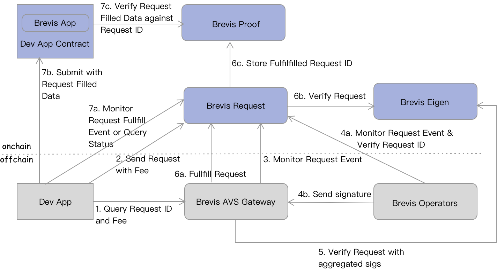

# Brevis + EigenLayer
## Operator
1. Make sure total stake > 32 eth, we support same strategies as Eigen DA
2. Add bls and ecdsa key of Eigenlayer info to config file  (eg. brevis.toml), both are required to join Brevis. Also recommend to change ethereum gateway RPC in the config file to a private one
3. Run `brevis join --chainid 1 --quorums 0x01` cmd to opt-in Brevis AVS
4. Add operator id printed by last `brevis join` command (bytes32 hex string) to config file, note it's NOT your ETH addr
5. (optional but recommended): Remove ecdsa key info from config file as it's not needed for normal operation. only bls key is needed
6. Operator runs `brevis run` cmd which monitors Brevis contract for new requests, and signs w/ BLS key, then posts to Brevis gateway

Contact Brevis team for any issue or questions. The `brevis` binary should be run under Linux AMD64 system.
The `brevis` binary also can be built from source with command: go build -o brevis.

## Gateway
- `brevis gw` cmd, needs a different config eg. gateway.toml
- accepts sig requests from eigenlayer operators, aggregate sigs, then send onchain
- accepts query requests from eigelayer operators, to query the original request data of a request ID
- accepts query requests from user, to query request ID and fee

## How the Brevis AVS works
<table><tr><td bgcolor='white'></td></tr></table>

1. Dev App queries request ID and fee amount from Brevis Gateway for a set of slots, receipts, and transactions from a supported chain to be certified by Brevis AVS. Gateway retrieves the storage slot value, receipt log value, or raw tx data etc from chain RPC node, and generates the request ID, which is a hash of the data. Refer to API [Prepare Query](#prepare-query).
2. Dev App then sends a request with the request ID, required fee to the `BrevisRequest` contract. Refer to [`BrevisContract.sendRequest`](https://github.com/brevis-network/brevis-contracts-avs/blob/main/contracts/core/BrevisRequest.sol#L77-L94). In AVS mode, `_callback` and `_option` params are not taking effect. 
3. Gateway monitors the request event emitted by the `BrevisRequest` contract, checks that the fee is sufficient, and updates the request status to `FEE_PAID`.
4. Brevis Operators respectively monitor the request event emitted by the `BrevisRequest` contract, retrieve the original request info from Brevis Gateway, and recalculate the request ID based on the data onchain. If the request ID matches, then operators respectively sign the request ID and send signature to Brevis Gateway. 
5. The gateway aggregates the signatures after the aggregation task is done, then submits to `BrevisEigen` contract to check signatures. `BrevisEigen` will record the verification status. Refer to [`BrevisEigen`](https://github.com/brevis-network/eigenlayer-middleware/blob/mybrv/src/BrevisEigen.sol) contract.
6. The gateway calls BrevisRequest contract to fulfill the request. BrevisRequest will check with `BrevisEigen` contract if the request ID is verified, and store the request ID to `BrevisProof` contract.
7. Finally, the Brevis App can use the reqeust filled data (Refer to [`ExtractInfos`](https://github.com/brevis-network/brevis-contracts-avs/blob/main/contracts/lib/Lib.sol#L37-L41)), if the data hash is the same with the stored request ID in `BrevisProof` contract. Refer to [`BrevisApp`](https://github.com/brevis-network/brevis-contracts-avs/blob/main/contracts/core/BrevisApp.sol) for an abstract contract that can be inherited by Dev team.

## Gateway API Reference

### Endpoint
1) Holesky Testnet - https://testnet-api.brevis.network
2) Ethereum Mainnet - https://api.brevis.network

### Prepare Query

To start a data usage process, the user sends `PrepareQueryRequest` to the gateway and receives `PrepareQueryResponse`

* POST /brvgw/prepareQuery
* Content-Type: application/json; charset=UTF-8

#### PrepareQueryRequest

| Name | Type | Description |
| ---- | ---- | ---- |
| chain_id | uint64 | the data from chain id |
| target_chain_id | uint64 | the chain uses the data |
| receipt_query_infos | Array<ReceiptQueryInfo> | list of receipts *optional |
| storage_query_infos | Array<StorageQueryInfo> | list of storage slots *optional |
| transaction_query_infos | Array<TransactionQueryInfos> | list of txs *optional |

##### ReceiptQueryInfo

| Name | Type | Description |
| ---- | ---- | ---- |
| tx_hash | string | tx hash of the receipt |
| log_query_infos | Array<LogQueryInfo> | list of logs in the receipt |

##### LogQueryInfo

| Name | Type | Description |
| ---- | ---- | ---- |
| log_index | uint64 | index of the log in the receipt, start from 0 |
| is_value_from_topic | bool | true if the value is retrieved from log topic |
| value_index | uint64 | index of the value in the log, splitted per each 32 bytes if the value is in the log data field |

##### StorageQueryInfo

| Name | Type | Description |
| ---- | ---- | ---- |
| blk_hash | string | from which block |
| account | string | address of the account to retrieve storage slot value from |
| slot | string | slot key |

##### TransactionQueryInfo

| Name | Type | Description |
| ---- | ---- | ---- |
| tx_hash | string | tx hash |

#### PrepareQueryResponse

| Name | Type | Description |
| ---- | ---- | ---- |
| query_hash | string | the generated request id |
| fee | string | fee, charge gas token in WEI |

## Deployment
### Holesky Testnet
1) BrevisRequest - 0xe0A61C0CAa3D8DE34bE6D31Bc4429ff1D51893A8
2) BrevisProof - 0xFF71BA4db245F08c739492b67e65D77C5B04B325
3) BrevisEigen - 0x7A46219950d8a9bf2186549552DA35Bf6fb85b1F

### Ethereum Mainnet

1) BrevisRequest - 0x63A825ADD2129410628a8561dDD059646FB49aB0
2) BrevisProof - 0x9E10764042A2168dE8B8Aab8E7862eF98E759F90
3) BrevisEigen - 0x9FC952BdCbB7Daca7d420fA55b942405B073A89d